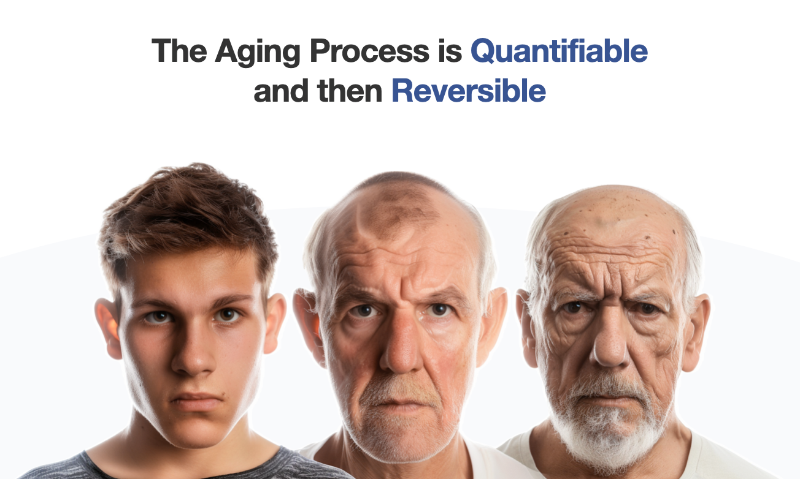
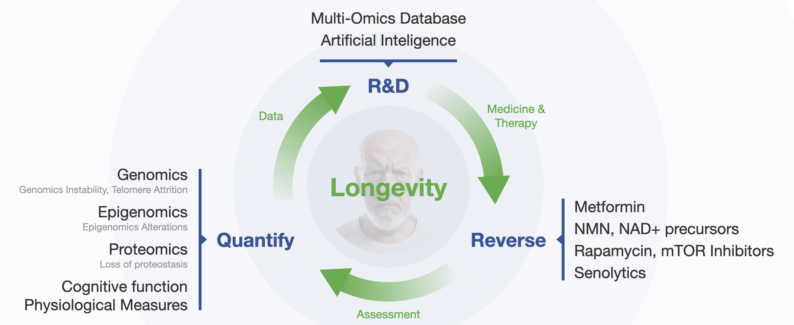
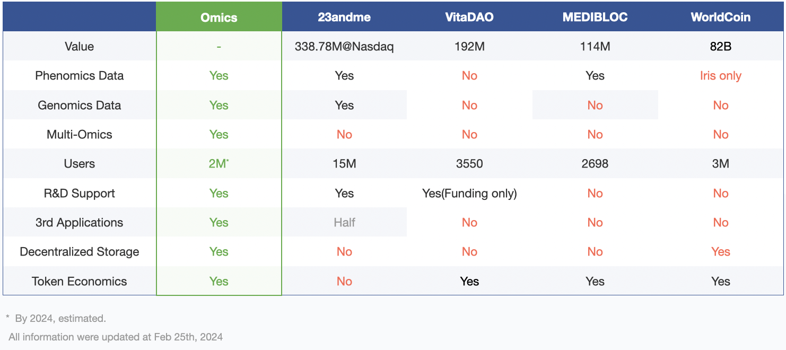

# Introduction

Omics is a DeSci Network for Human Longevity driven by Multi-Omics and AI.

## Insights

Human Longevity stands as the focal point in life science, transitioning from an experience or experiment-driven to a data and AI-driven paradigm.

Multi-omics data from large-scale populations is instrumental in quantifying and comprehending human longevity. This approach facilitates the identification of aging biomarkers and the development of anti-aging medicines.

Decentralized technologies, including blockchain, zero-knowledge proof, federated artificial intelligence, and decentralized storage, can unlock the value of multi-omics data in longevity research and applications while ensuring data ownership, privacy protection, and compliance with regulatory policies.

Tokenomics incentivizes various participants, including users, app developers, service providers, multi-omics sequencing centers, operators, scientists, and others, to contribute their sample, omics data, sequencing capability and specialized expertise towards advancing human longevity.

## Challenges

* High cost to accumulate multi-omics data for longevity
  * Generating omics data, such as whole-genome epigenomics sequencing, incurs a substantial cost, approximately $500 USD per individual.
  * Traditional longevity-related studies, exemplified by initiatives like UK Biobank and All of Us, face high costs in phenotype collection and multi-omics data generation.
* Limited Public Engagement:
  * Despite rapid developments in omics technologies, there is a lack of public enthusiasm to donate samples and participate in research projects. 
  * The general population does not fully benefit from the advancements in omics technologies.
* Ownership and Privacy Concerns:
  * Omics data is invaluable for human longevity research and development.
  * Individual multi-omics data constitutes a fundamental aspect of personal privacy, impacting not only the individual but also their family.
* Regulation:
  * Governments globally impose stringent regulations on omics data, particularly genomics data, to safeguard privacy and biosafety.
  * Compliance with these diverse regulatory policies is essential for omics R&D and applications. 

## Solutions

A Decentralized Storage and Analysis Network with Tokenomics is the unparalleled solution to unleash the full potential of Multi-Omics to enable groundbreaking advancements in human longevity research and application.

* Decentralized technologies to ensure ownership and protect privacy:
  * Immutability of blockchain ensure everyone’s ownership of omics data.
  * Zero-knowledge proof to preserve individual‘s privacy during query and analysis
  * Federal query and machine learning for search and analysis
  * Decentralized omics data storage to meet the different regulation policies in different areas
* Utility token to purchase applications for individuals and collect data for R\&D purpose (see “[Tokenomics](tokenomics.md)” for details)

## Vision

The healthspan for 100 years!

Enabling groundbreaking advancements in human longevity research and development by harnessing the potential of a globally decentralized network of multi-omics data and AI technologies. 

Our vision is to create an active ecosystem that efficiently manages and leverages multi-omics data and AI technologies, fostering human longevity collaboration and innovation, helping the Omics participants enjoy a 100 years healthspan.

## Comparison

